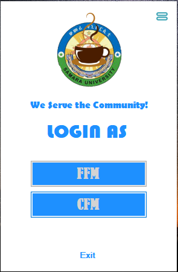
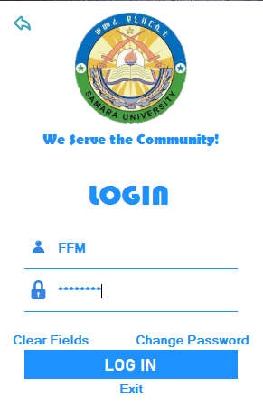
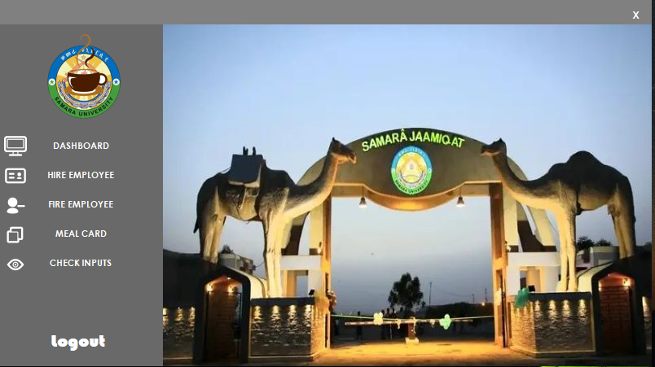
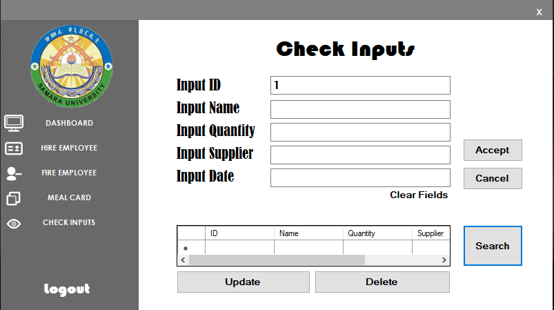

# Samara University Cafe Management System
This project helps controlling the management system of Students' Cafeteria in Samara University (Afar, Ethiopia).
## Plateform
Desktop (Windows) Application
## Prototype
### LoginAs Page
This page is where the managers choose their previlage.

### Login Page
Normally the login page interface is similar for both managers, except the value.

### Home Page
The page where the user initially navigates to after login.

### Check Inputs Page
This is one of the many functional pages those the project included.

## Technologies Used

## IDE

## The Project
This project were developed for the semester project of 4th year Computer Engineering class at Samara University.
### Members
This project developed with the contribution of five members : 
* Ezedin
* Daniel
* Ayalew
* Oumer
* Rediet
### School Info
Name - Samara University
Location - Afar, Ethiopia
Website - [Samara University](https://www.su.edu.et/)
## My Last Word
I always believe `Difficulties make the victim more stronger`, be sure.
Albert Einstein once said 
> In the middle of difficulty lies opportunity.

Thanks!!! @Eze-Din
